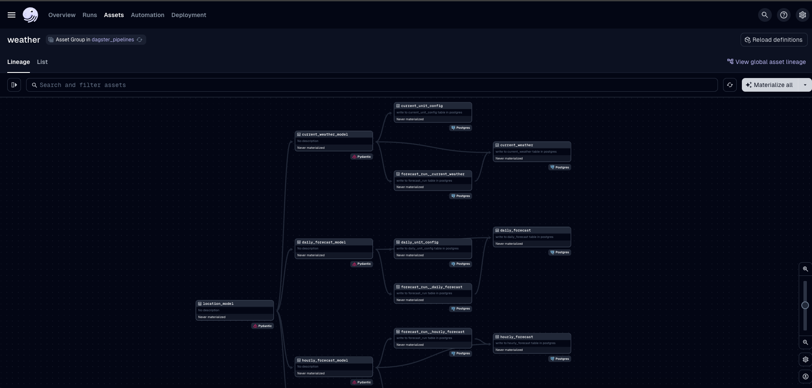

# Open-Meteo Weather Data Pipeline

## Overview
This project retrieves weather data from the [Open-Meteo API](https://open-meteo.com/) using a custom API client and data pipelines orchestrated with dagster. The pipelines normalize the json response into a relational schema and write it to a postgres database.

## Installation

### Prerequisites
- Python3.9+
- PostgreSQL
- pip and virtualenv

### Setup
1. Clone the repository:
   ```sh
   git clone https://github.com/jlee1028/open-meteo-pipeline.git
   cd open-meteo-pipeline
   ```
2. Create and activate a virtual environment:
   ```sh
   python -m venv .venv
   macos: source .venv/bin/activate
   windows: .venv\Scripts\activate
   ```
3. Install the project in editable mode:
   ```sh
   pip install -e ".[dev]"
   ```
4. Configure environment variables (e.g., in a `.env` file):
   ```ini
    POSTGRES_ENDPOINT={your_postgres_endpoint}
    POSTGRES_DB={your_postgres_db}
    POSTGRES_USER={your_postgres_user}
    POSTGRES_PASSWORD={your_postgres_pw}
   ```

## Usage

### Running the Pipelines
Run the dagster webserver:
```sh
docker-compose up --build
```

(without docker)
```sh
dagster dev
```

Then go to the dagster UI in your browser (http://127.0.0.1:3000) and materialize all or specific assets:




### Using the API client

Get location object:
```python
from api_client.geocoding.client import GeocodingClient

# get redmond location
geo_client = GeocodingClient()
results = geo_client.search('Redmond')
redmond = [r for r in results if r.admin1 == 'Washington'].pop()

print('redmond:\n')
for k, v in redmond.model_dump().items():
    print(k, v)
```

Get weather data for location:
```python
from api_client.weather_forecast.client import WeatherForecastClient

weather_client = WeatherForecastClient()

# get current weather for redmond
current_weather = weather_client.get_current_weather(location=redmond)

print('\ncurrent weather:\n')
for k, v in current_weather.current.model_dump().items():
    print(k, v)
    
# get hourly forecast for redmond
hourly_forecast = weather_client.get_hourly_forecast(location=redmond)

print('\nhourly forecast:\n')
for k, v in hourly_forecast.hourly.model_dump().items():
    print(k, v[:3])

# get daily forecast for redmond
daily_forecast = weather_client.get_daily_forecast(location=redmond)

print('\ndaily forecast:\n')
for k, v in daily_forecast.daily.model_dump().items():
    print(k, v[:3])
```

## Database Schema
The json reponses from the open-meteo api are normalized into the following relational tables:
### dimensional data
- **location:** location data - each record represents a unique location. Records are upserted
- **current_unit_config:** stores unique configuration of units of measurement for *current* weather variables (e.g inches or centimeters of rain). Records are upserted
- **hourly_unit_config:** stores unique configuration of units of measurement for *hourly* weather variables. Records are upserted
- **daily_unit_config:** stores unique configuration of units of measurement for *daily* weather variables. Records are upserted
### fact data
- **forecast_run:** stores the main info for each distinct API call, including the location and timezone for the weather variables. Normalized out from the weather data to remove data duplication. Records are inserted
- **current_weather:** stores the actual values for the weather variables requested. Records are inserted
- **hourly_forecast:** stores the actual values for the weather variables requested. Records are inserted
- **daily_forecast:** stores the actual values for the weather variables requested. Records are inserted

The following relationships are established and enforced in the relational model:
- **forecast_run** is many to one with **location**, enforced by the foreign key *location_id*

- **current_weather** is many to one with **current_unit_config**, enforced by the foreign key *unit_config_id*
- **current_weather** is many to one with **forecast_run**, enforced by the foreign key *forecast_run_id*
- **current_weather** is many to one with **location**, enforced by the foreign key *location_id*

- **hourly_forecast** is many to one with **hourly_unit_config**, enforced by the foreign key *unit_config_id*
- **hourly_forecast** is many to one with **forecast_run**, enforced by the foreign key *forecast_run_id*
- **hourly_forecast** is many to one with **location**, enforced by the foreign key *location_id*

- **daily_forecast** is many to one with **daily_unit_config**, enforced by the foreign key *unit_config_id*
- **daily_forecast** is many to one with **forecast_run**, enforced by the foreign key *forecast_run_id*
- **daily_forecast** is many to one with **location**, enforced by the foreign key *location_id*
